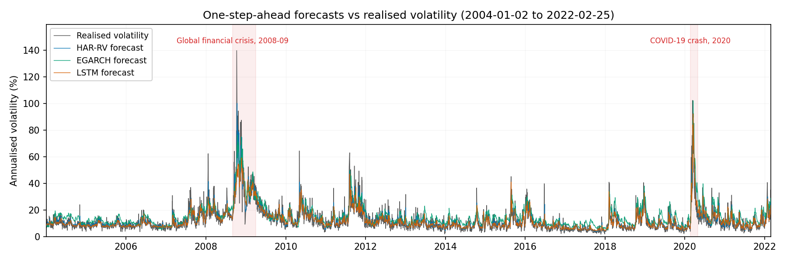
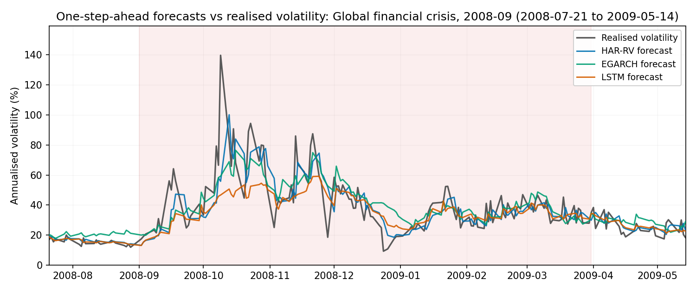
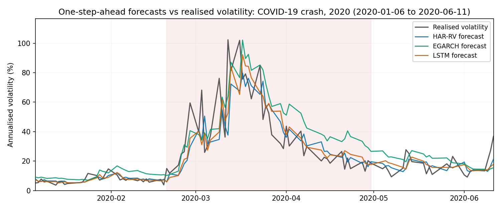
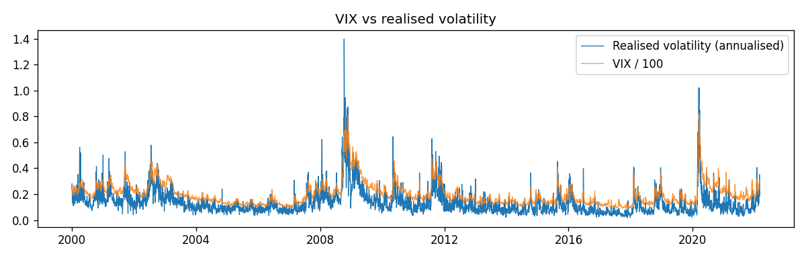

# Beyond GARCH? — Volatility Forecasting Comparison

**A rigorous comparison of classical and deep learning models for forecasting S&P 500 realised volatility.**

MSc Data Science dissertation, University of Surrey (2025–26). Author: Danish Whelan Bin Zamri.
Supervisor: Dr Tom Thorne. The full dissertation is in
[`docs/Beyond_GARCH_Dissertation.pdf`](docs/Beyond_GARCH_Dissertation.pdf).

## Summary

A substantial recent literature reports that deep learning beats the classical econometric
models long standard in volatility forecasting. Many of those comparisons evaluate against
noisy proxies, use unverified baselines, rely on a single fixed split and omit significance
tests. This project tests the claim under a deliberately strict protocol.

Seven model configurations — EWMA, GARCH(1,1), EGARCH, GJR-GARCH, HAR-RV, an LSTM and a
GARCH-LSTM hybrid — are evaluated on **4,005 one-day-ahead forecasts of S&P 500 realised
volatility (Jan 2004 – Feb 2022)** using:

- an **expanding-origin walk-forward** harness, built before any model, that prevents
  look-ahead bias by construction and is verified by adversarial leakage tests;
- **5-minute realised variance** (Oxford-Man Realised Library) as the target, not squared returns;
- the **QLIKE** loss (robust to proxy noise; Patton, 2011), with RMSE alongside;
- **Diebold-Mariano** tests (Newey-West HAC variance, Harvey-Leybourne-Newbold correction) for
  every pairwise comparison, overall and per regime;
- disaggregation across **calm, GFC 2008–09 and COVID 2020** regimes;
- **five random seeds** for every deep model;
- GARCH-family baselines **validated against published S&P 500 parameter estimates**.

## Key findings

1. **No deep model beats HAR-RV.** The LSTM's QLIKE (0.2137) is nominally below HAR-RV's
   (0.2160), but the difference is not significant (DM p = 0.25). The hybrid is likewise tied
   (p = 0.71). A linear regression on three lagged averages of realised volatility matches
   the deep models.
2. **The LSTM's parity comes entirely from the VIX feature, not the architecture.** With the
   implied-volatility (VIX) input removed, the LSTM has the same information as HAR-RV. It then
   falls significantly behind HAR-RV (DM −6.72, p < 0.0001). Removing VIX raises crisis loss by
   ~45% in 2008 and ~62% in 2020. On equal information, the deep architecture does worse than
   the linear model.
3. **Adding the GARCH feature to the LSTM changes where it is accurate, not how accurate it is
   overall.** Removing the GARCH-derived feature from the hybrid has no aggregate effect
   (p = 0.42). Inside that null, the feature significantly helps in the 2008 crisis
   (p = 0.0009) and slightly hurts in calm markets (p = 0.036).
4. **The aggregate ranking hides regime effects.** HAR-RV's lead over the GARCH family comes
   almost entirely from calm markets. In the 2020 crash EGARCH beats it (0.334 vs 0.487). The
   LSTM is significantly worse than HAR in 2008 (p = 0.019) but marginally better in 2020
   (p = 0.087).
5. **Asymmetry matters for equities.** EGARCH and GJR-GARCH both significantly beat
   symmetric GARCH(1,1), and EGARCH beats GJR (p = 0.002). This agrees with Hansen & Lunde (2005).
6. **The deep models cost about 2,900× more compute for equal accuracy.** HAR-RV completes all
   4,005 walk-forward origins in 4.5 s, refitting at every origin. The hybrid took ~3.6 h over
   five seeds, and that was with only monthly refitting.

### Overall accuracy (4,005 forecasts, lower is better)

| Model | QLIKE | RMSE (vol) |
|---|---|---|
| EWMA (λ = 0.94) | 0.3543 | 0.00519 |
| GARCH(1,1) | 0.3550 | 0.00475 |
| GJR-GARCH | 0.3329 | 0.00461 |
| EGARCH | 0.3240 | 0.00397 |
| **HAR-RV** | **0.2160** | **0.00330** |
| LSTM (5 seeds) | 0.2137 (±0.0013) | 0.00332 |
| GARCH-LSTM hybrid (5 seeds) | 0.2168 (±0.0007) | 0.00335 |

Deep models report the mean (± s.d.) across seeds. DM tests use the seed-averaged forecast.

### QLIKE by market regime

| Model | Calm (n = 3,821) | GFC 2008 (n = 138) | COVID 2020 (n = 46) |
|---|---|---|---|
| EWMA | 0.348 | 0.356 | 0.860 |
| GARCH(1,1) | 0.355 | 0.286 | 0.570 |
| GJR-GARCH | 0.334 | 0.251 | 0.514 |
| EGARCH | 0.329 | **0.193** | **0.334** |
| HAR-RV | 0.213 | 0.200 | 0.487 |
| LSTM | **0.210** | 0.272 | 0.367 |

### Ablations: where the forecast skill comes from

| Contrast | Overall | Calm | GFC 2008 | COVID 2020 |
|---|---|---|---|---|
| **Information:** LSTM vs LSTM without VIX (DM, p) | −6.92, <0.0001 | −5.54, <0.0001 | −3.84, 0.0002 | −2.67, 0.011 |
| **Architecture:** HAR vs LSTM without VIX (DM, p) | −6.72, <0.0001 | −5.39, <0.0001 | −3.71, 0.0003 | −2.08, 0.043 |
| **Structure:** hybrid vs hybrid without GARCH (DM, p) | +0.80, 0.42 | +2.09, 0.036 | −3.40, 0.0009 | −0.61, 0.55 |

A negative DM statistic favours the first-named model. Each ablated arm is trained on exactly
the same observations as its comparator.

### Baseline validation

GARCH(1,1) persistence (α + β) averages ~0.985 across all 4,005 fits, inside the 0.98–0.99
range published for daily equity indices. EGARCH and GJR asymmetry terms have the expected
leverage sign in every fit. Every fit converged and was stationary. Per-origin parameter paths
are in `results/*_params.csv`, and the comparisons with published values are in
`results/*_param_validation.csv`.

### Figures

| | |
|---|---|
|  |  |
| Leading models vs realised volatility, 2004–2022 | Global financial crisis, 2008–09 |
|  |  |
| COVID-19 crash, 2020 | VIX vs annualised realised volatility |

Exploratory figures (`fig1`–`fig5`) show returns, volatility clustering, the ACF of returns
vs squared returns, fat tails and the VIX–RV relationship.

### Limitations

- The study tests one standard LSTM configuration, with hyper-parameters fixed a priori. Other
  architectures (TCN, transformer) are untested.
- Deep models are refit monthly; classical models are refit at every origin. This is a
  documented deviation, made for tractability, and if anything it disadvantages the deep models.
- The study covers a single index (S&P 500), 2004–2022. The Oxford-Man library was
  discontinued, so the target ends on 2022-02-25.
- Realised volatility is still a proxy for a latent quantity. QLIKE mitigates this but does
  not remove it.

**The most direct extension:** give the classical models the same information, for example a
HAR-RV model with VIX as an extra regressor (HAR-X).

## Environment setup

```bash
conda create -n vol python=3.11 -y
conda activate vol
pip install -r requirements.txt
```

The pinned numerical stack (numpy/scipy/arch/statsmodels) only ships wheels for
Python 3.11/3.12, so the 3.11 env above is required; newer interpreters try to
build from source and fail.

Verify the environment works in a fresh terminal:

```bash
python --version      # should print Python 3.11.x
python -c "import pandas, numpy, arch, yfinance, statsmodels; print('ok')"
```

## Reproducing the results

```bash
python src/download_data.py        # one-time: fill data/raw (SPY, VIX); Oxford-Man file is archived, see below
python src/build_target.py         # build + validate data/processed/modelling_data.csv
python src/eda.py                  # exploratory figures fig1-fig5 and summary_stats.csv
python src/run_evaluation.py       # full model ladder -> forecasts, metrics, DM tests, params
python src/run_ablation.py         # LSTM without VIX (information ablation)
python src/run_hybrid.py           # GARCH-LSTM hybrid + no-GARCH arm (structure ablation)
python src/ablation_report.py      # ablation_vix.csv / ablation_decomposition.csv
python src/time_classical.py       # classical-model timings -> results/timings.csv
python src/plot_forecasts.py --comparison   # comparison figures
pytest                             # 62 tests, incl. adversarial leakage tests
```

The deep-model runs take several hours on CPU. Every number in the dissertation is
regenerable from `data/raw` by running code.

## Project structure

```
data/raw/         Immutable downloaded data (git-ignored; see provenance). NEVER edit by hand.
data/processed/   Cleaned, aligned modelling dataframe (built by code; git-ignored).
docs/             Dissertation PDF.
src/              Data pipeline, models, walk-forward harness, evaluation scripts.
tests/            Unit, leakage and integrity tests (pytest).
results/          Forecasts, metric tables, DM tests, parameter paths, figures.
```

## Reproducibility rule

Every number in the dissertation must be regenerable from `data/raw` by running code.
Raw files are never edited by hand. All cleaning happens in `src/`.

## Data provenance log

| Dataset | File | Source URL | Downloaded | Notes |
|---|---|---|---|---|
| SPY daily OHLCV | data/raw/spy_daily.csv | yfinance 1.5.1 (ticker SPY) | 2026-07-20 | full history, 2000-01-03 to 2026-07-20 (6675 rows) |
| VIX daily | data/raw/vix_daily.csv | yfinance 1.5.1 (ticker ^VIX) | 2026-07-20 | exogenous feature, 2000-01-03 to 2026-07-20 |
| S&P 500 realised volatility | data/raw/oxfordman_raw.csv | https://web.archive.org/web/20220301022212id_/https://realized.oxford-man.ox.ac.uk/images/oxfordmanrealizedvolatilityindices.zip | 2026-07-20 | Full unfiltered Oxford-Man library (Wayback snapshot 2022-03-01). Library discontinued; this is the frozen archived copy. S&P 500 = symbol `.SPX`, target measure `rv5`, filtered in build_target.py. Data ends 2022-02-25. Cite Heber et al. (2009) |

**yfinance version note:** requirements.txt pinned `yfinance==0.2.40`, which no longer
authenticates against Yahoo's current API (empty response / `No timezone found`). It was
upgraded to `1.5.1` to perform the one-time download and the pin relaxed to `yfinance>=1.5`.
yfinance is only the download pipe: once `data/raw/*.csv` are frozen it plays no further
role, so this does not affect the numerical reproducibility contract.

**RV coverage limitation:** because the Oxford-Man library was frozen at discontinuation,
the realised-volatility target ends **2022-02-25**. The processed modelling set
(`data/processed/modelling_data.csv`, 4877 rows) is therefore 2000-01-04 to 2022-02-25,
even though SPY/VIX run to 2026. The originally planned 2022-drawdown regime was therefore
replaced by the calm / GFC 2008 / COVID 2020 regime split used throughout.
